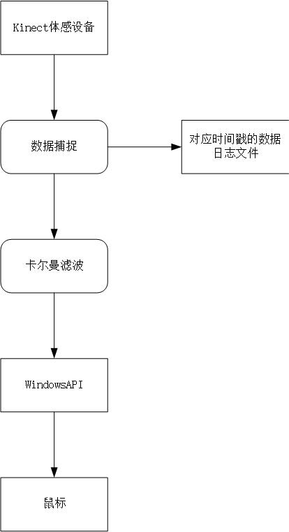
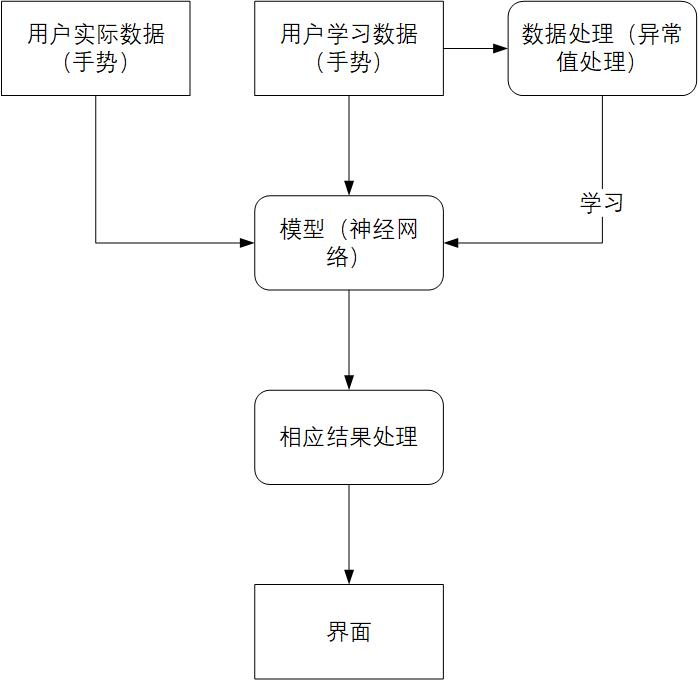

# Kinect鼠标控制
# 已经实现：
- 1. 鼠标已经可以移动
- 2. 最简单的**卡尔曼滤波**对数据进行处理
- 3. 数据流图如下

# 下一步计划：
## 1. 实现手势识别神经网络的搭建
- 1. 从Kinect官方自带的例子中，找到提取Kinect深度点云的方法
- 2. 将**二维深度点云**转变为**三维点云**(结合百度上已有的项目)
- 3. 在得到大量的实验数据后，利用数据挖掘的手段对数据进行处理(异常值的去除)
- 4. 利用**tensorflow**等深度学习的框架，建立模型，利用上一步中的数据进行模型的**学习**
- 5. 利用已经训练好的模型，识别用户的数据，从而能达到手势的识别效果
- ***环境: Python 和 Matlab***

## 2. 实现骨骼结点和骨骼点云(三维)的切换显示
- 1. 使用菜单即可，可以单独显示骨骼点云，也可单独显示骨骼位置
- 2. 显示当前做出的动作
- 3. 界面设计 
- ***环境: C#***

## 3. 项目文档
## 4. 体感照相(视情况)

# 放假前给老师看这个：
